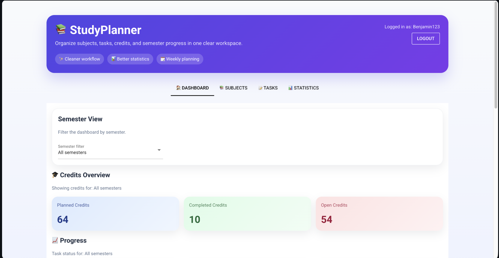
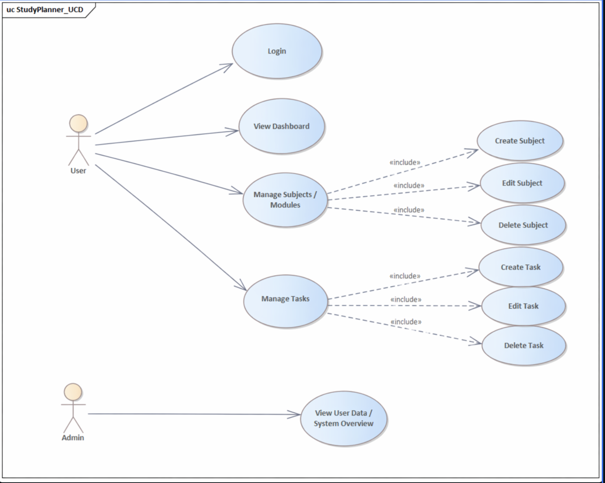
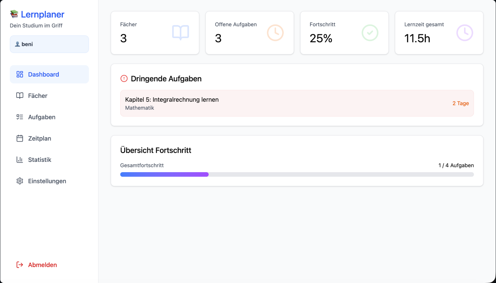
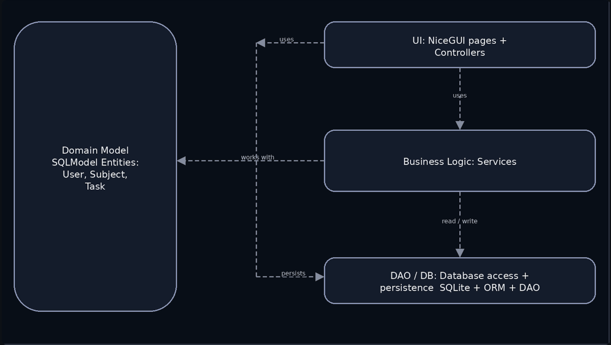

# 📚 StudyPlanner – Study Planning



---

Dieses Projekt zeigt die Entwicklung einer browserbasierten Anwendung mit **NiceGUI**. Der Fokus liegt auf einer sauberen Architektur, Aufgabenorganisation, Fortschrittsverfolgung und Datenbankintegration über ein ORM.

Das Projekt verfolgt folgende Ziele:

- den vollständigen Prozess von der **Anforderungsanalyse bis zur Umsetzung** abdecken
- fortgeschrittene **Python-Konzepte** in einer webbasierten Anwendung anwenden
- Studierende bei der Organisation von Fächern, Aufgaben und Lernzeiten unterstützen
- eine klare Übersicht über Deadlines, Fortschritt und dringende Prioritäten bieten
- sauberen, wartbaren und gut strukturierten Code erstellen
- **Teamarbeit und professionelle Dokumentation** unterstützen

---

## 📝 Anforderungen der Anwendung

### Problem

Studierende haben oft Schwierigkeiten, ihre akademische Arbeitsbelastung effizient zu organisieren. Aufgaben, Lernzeiten und Deadlines sind häufig über verschiedene Tools verteilt. Dadurch können Fristen verpasst, Prioritäten falsch gesetzt und der eigene Lernfortschritt nur schwer überblickt werden.

---

### Szenario

Die Anwendung ermöglicht es Benutzern:

- Fächer zu organisieren
- Aufgaben und Abgaben zu verwalten
- Deadlines übersichtlich darzustellen
- den Lernfortschritt zu verfolgen
- Empfehlungen für dringende Aufgaben zu erhalten
- eine einfache Lernstatistik anzuzeigen

---
## 📖 User Stories

### 1. Benutzer einloggen
**Als Benutzer möchte ich mich einloggen, damit ich auf mein persönliches Dashboard und meine Studiendaten zugreifen kann.**

- **Eingaben:** E-Mail (`str`), Passwort (`str`)  
- **Ausgaben:** Dashboard (`Dashboard`)

---

### 2. Dashboard anzeigen
**Als Benutzer möchte ich mein Dashboard in der Browser-App sehen, damit ich einen Überblick über meine Aufgaben, Deadlines und meinen Studienfortschritt bekomme.**

- **Eingaben:** keine  
- **Ausgaben:** offene Aufgaben, bevorstehende Deadlines, Fortschrittsübersicht

---

### 3. Fächer / Module verwalten
**Als Benutzer möchte ich Fächer oder Module erstellen und verwalten, damit ich mein Studium organisieren kann.**

- **Eingaben:** Fachname (`str`), Beschreibung (`str`), Farbe (`str`), Prüfungsdatum (`date`), optional Dozent (`str | None`), Aktion (`str`) = `create | edit | delete`  
- **Ausgaben:** erstellte oder aktualisierte Fächerliste
  
---

### 4. Aufgaben verwalten
**Als Benutzer möchte ich Aufgaben für ein Fach erstellen und verwalten, damit ich Abgaben und Deadlines organisieren kann.**

- **Eingaben:** Titel (`str`), Beschreibung (`str`), Fachname (`str`), Deadline (`date`), Priorität (`int`), Status (`str`) = `open | in_progress | done`, Aktion (`str`) = `create | edit | delete`
- **Ausgaben:** erstellte oder aktualisierte Aufgabenliste

---

## 🧩 Use Cases



### Main Use Cases
- Login (Benutzer)  
- Dashboard anzeigen (Benutzer)  
- Fächer / Module verwalten (Benutzer)  
- Aufgaben verwalten (Benutzer)  

### Actors
- Benutzer  

---

### Wireframes / Mockups



---

## 🏛️ Architecture




## Schichten

- **UI:** NiceGUI als browserbasierte Benutzeroberfläche
- **Anwendungslogik:** Controller und Services
- **Persistenz:** SQLite + ORM + Datenzugriff (DAO)

## Architekturentscheidungen

- MVC-Struktur (Model–View–Controller)
- klare Trennung der Verantwortlichkeiten
- Businesslogik unabhängig von der Benutzeroberfläche

## Verwendete Design Patterns

- **Model–View–Controller / geschichtete MVC-Variante:** NiceGUI-Seiten und Controller verarbeiten die Benutzerinteraktion, Services setzen die Use Cases um, und die Persistenz ist in DAO-/DB-Komponenten getrennt.
- **Data Access Object (DAO):** DAOs kapseln Datenbankabfragen und Persistenzlogik von der Businesslogik.
- **Facade Pattern:** Eine Datenbank-/Facade-Komponente kann die Erstellung der Engine, den Schemaaufbau und das Session-Handling zentralisieren.

---

## 🗄️ Database and ORM

Die Anwendung verwendet **SQLModel**, um Domain-Objekte auf eine SQLite-Datenbank abzubilden.

### Entitäten
- `User`
- `Subject`
- `Task`

### Beziehungen
- Ein `Subject` kann mehreren `Tasks` zugeordnet sein.
- Ein `Task` gehört zu einem `User` und kann einem `Subject` zugeordnet werden.
  
---

## ✅ Projektanforderungen

Unser Projekt erfüllt die zentralen Anforderungen des Moduls:

1. browserbasierte Webanwendung mit **NiceGUI**
2. **Datenvalidierung** in der Anwendung
3. **Datenbankverwaltung mit ORM**

---

## 1. Browserbasierte Anwendung (NiceGUI)

Unsere Anwendung wird mit **NiceGUI** als browserbasierte Webanwendung umgesetzt.  
Benutzer können über den Browser:

- sich einloggen
- das Dashboard anzeigen
- Fächer / Module verwalten
- Aufgaben erstellen, bearbeiten und löschen
- offene Aufgaben und Deadlines ansehen

Der Browser dient dabei als Benutzeroberfläche, während die Logik der Anwendung serverseitig verarbeitet wird.

---

## 2. Datenvalidierung

In unserer Anwendung werden Eingaben geprüft, damit nur gültige Daten gespeichert werden.  
Dadurch werden Fehler vermieden und die Benutzerführung verbessert.

Beispiele:

- Login-Daten müssen korrekt eingegeben werden
- Pflichtfelder wie Fachname oder Aufgabentitel dürfen nicht leer sein
- Deadlines müssen ein gültiges Datum haben
- Aufgabenstatus darf nur erlaubte Werte enthalten

---

## 3. Datenbankverwaltung

Die Daten unserer Anwendung werden in einer **SQLite-Datenbank** gespeichert.  
Für die Verwaltung verwenden wir ein **ORM**, damit die Datenbank über Python-Modelle statt über direktes SQL angesprochen wird.

Gespeichert werden unter anderem:

- Benutzer
- Fächer / Module
- Aufgaben

Dabei gelten zum Beispiel diese Beziehungen:

- Ein **User** kann mehrere **Subjects** haben
- Ein **Subject** kann mehrere **Tasks** enthalten

---

## ⚙️ Implementation

### Technology

- Python 3.x  
- NiceGUI  
- SQLModel
- pytest  

---

### 📚 Libraries Used

- **nicegui** – UI framework  
- **sqlmodel** – ORM  
- **pytest** – testing 
  
---

## Repository Struktur

```text
study_planner/
├── __init__.py
├── __main__.py
├── application.py
│
├── data_access/
│   ├── db.py
│   └── seed.py
│
├── domain/
│   ├── __init__.py
│   └── models.py
│
├── services/
│   ├── __init__.py
│   ├── export_service.py
│   ├── subject_service.py
│   ├── task_service.py
│   └── user_service.py
│
└── ui/
    ├── __init__.py
    ├── auth.py
    ├── controllers.py
    └── pages/
      ├── __init__.py
      ├── auth_view.py
      ├── dashboard_section.py
      ├── main_page.py
      ├── page_actions.py
      ├── page_helpers.py
      ├── page_refresh.py
      ├── shared.py
      ├── statistics_section.py
      ├── subjects_section.py
      └── tasks_section.py
```
    ### Ordner-Erklärung

- `application.py`: Startet und konfiguriert die Anwendung.
- `data_access/`: Enthält den Zugriff auf die Datenbank und die Persistenzlogik.
- `domain/`: Enthält die Domain-Modelle bzw. Klassen der Anwendung.
- `services/`: Enthält die Businesslogik und die Services der Anwendung.
- `ui/`: Enthält die Benutzeroberfläche, Seiten und Controller.

---

## 🚀 Verwendung

## How to Run

> 🚧 An unser Projekt angepasst.

### 1. Projekt-Setup

- Für das Projekt wird **Python 3.13** oder die im Kurs verwendete Python-Version benötigt.
- Erstelle und aktiviere eine virtuelle Umgebung:

  - **macOS / Linux:**
    ```bash
    python3 -m venv .venv
    source .venv/bin/activate
    ```

  - **Windows:**
    ```bash
    python -m venv .venv
    .venv\Scripts\activate
    ```

- Installiere die Abhängigkeiten:
  ```bash
  pip install -r requirements.txt
  ```

### 2. Konfiguration

* Stelle sicher, dass alle benötigten Pakete installiert sind.
* Falls notwendig, passe Konfigurationswerte an, zum Beispiel:
    * Datenbankpfad
    * Port der Anwendung
    * Umgebungsvariablen
* Die Anwendung verwendet NiceGUI als browserbasierte Oberfläche und eine SQLite-Datenbank mit ORM für die Persistenz.

### 3. Starten der Anwendung

Starte die Anwendung mit:
```bash
cd Objektorientierte-Programmierung-Projektarbeit-main
python3 -m study_planner
  ```

* Öffne danach die in der Konsole angezeigte URL im Browser.

### 4. Nutzung der Anwendung

Lernplaner verwenden

1. Anwendung im Browser öffnen
2. Mit E-Mail und Passwort einloggen
3. Dashboard aufrufen
4. Fächer / Module anlegen, bearbeiten oder löschen
5. Aufgaben zu einem Fach erstellen
6. Aufgabenstatus und Deadlines verwalten
7. Offene Aufgaben und anstehende Deadlines im Dashboard ansehen

Beispielhafter Ablauf

1. Ein Benutzer loggt sich in die Anwendung ein.
2. Danach öffnet er das Dashboard.
3. Anschliessend legt er ein neues Fach / Modul an.
4. Danach erstellt er eine oder mehrere Aufgaben für dieses Fach.
5. Die Aufgaben werden in der Datenbank gespeichert und später wieder angezeigt.

### 5. Technischer Hinweis

Die Anwendung läuft als browserbasierte Webanwendung.
Der Browser dient als Benutzeroberfläche, während die Geschäftslogik serverseitig verarbeitet wird.
Die Daten werden über eine Datenbank mit ORM verwaltet, statt direkt mit SQL zu arbeiten.

---

## 🧪 Tests

### Test mix:

- **Insgesamt 23 Tests**
- **19 Unit Tests:** z. B. Benutzerregistrierung, Login, Fach erstellen/bearbeiten/löschen, Aufgabe erstellen, Aufgabe als erledigt markieren, Fortschritt berechnen, Prioritätsverteilung, CSV-Export
- **2 Datenbank-Tests:** z. B. Speicherung von Fächern in der Datenbank, Rollback bei Fehlern
- **2 Integration Tests:** z. B. Zusammenspiel zwischen Services und Datenbank, Persistenz über mehrere Datenbank-Sessions

---

### Template für Testfälle

1. **Test case ID** – eindeutige Nummer, z. B. `TC_001`
2. **Test case title/description** – Was wird getestet?
3. **Preconditions** – Voraussetzungen vor dem Test
4. **Test steps** – Schritte, die ausgeführt werden
5. **Test data/input** – verwendete Eingabedaten
6. **Expected result** – erwartetes Ergebnis
7. **Actual result** – tatsächliches Ergebnis
8. **Status** – bestanden oder fehlgeschlagen
9. **Comments** – zusätzliche Hinweise oder gefundene Fehler

---

### Tests ausführen

Zuerst die Abhängigkeiten installieren:

```bash
pip install -r requirements.txt
```

Danach alle Tests ausführen:
```bash
pytest
```
Für eine ausführlichere Ausgabe:
```bash
pytest -v
```
---

## 👥 Team & Beiträge

| Name      | Beitrag |
|-----------|--------------|
| Andri Bader | Entwicklung des Hauptcodes, Umsetzung der Funktionen, Aufbau der Datenbankmodelle, Services und Benutzeroberfläche |
| Benjamin Sahile | README-Dokumentation, User Stories, Use Cases, Architektur- und Datenbankbeschreibung, Automatisierte Tests |
---
## 📝 Lizens

Dieses Projekt wurde ausschliesslich für Bildungszwecke im Rahmen des Moduls «Advanced Programming» an der FHNW erstellt.
